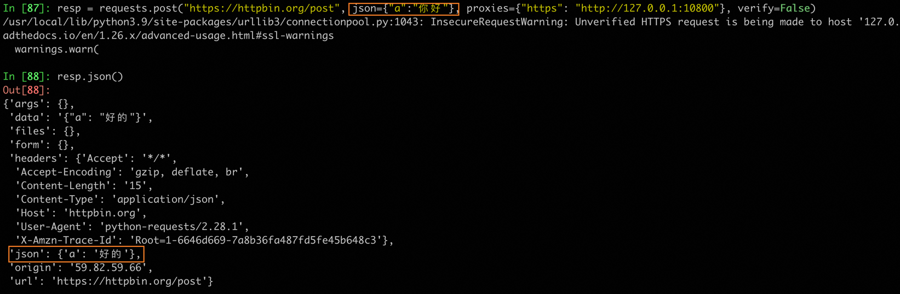
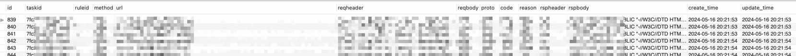
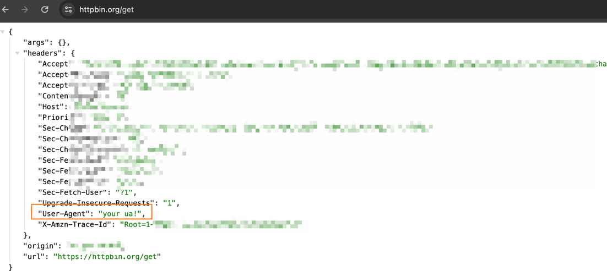
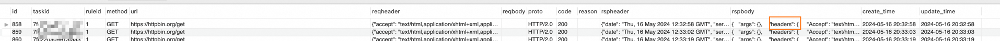
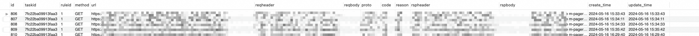

# SWProxy 项目文档
## 简介
这是一款极简的代理工具，支持HTTP和HTTPS协议，能够实现URL、请求头、请求体、响应头、响应体的修改，以及Web请求的全量存储
## 安装
1. 安装python(3.7)、mysql(8+)环境
2. 下载代码  
3. 安装第三方库  
`pip3 install -r requirements.txt`
4. 导入自定义/mitmproxy证书(否则无法在https场景中使用)，可以参考文档：https://www.jianshu.com/p/036e5057f0b9

## 配置
1. 自定义你的项目配置，对应的文件是config.yaml，可以配置代理端口、数据库账号等信息
2. 自定义你的代理配置，具体的编写方法可以参考文档：httpproxy.json.md

## 运行
终端执行命令：`python3 SWProxy.py`  
根据配置的不同，代理可以实现通过直接配置模式和脚本模式，对请求/响应进行替换或存储，下面就针对用法进行详细说明。
### 直接配置模式
#### 替换
1. 编写配置文件  
```
{
  "replace": [
    {
      "id": 1,
      "point":"reqbody",
      "match":"你好",
      "replace":"好的",
      "ignorecase": true,
      "count": 0
    }
  ]
}
```
2. 启动代理  
3. 结果验证  
  

#### 存储
1. 编写配置文件  
```
{
  "store": [
    {
      "id": 1,
      "point":"url",
      "match":"ppp",
      "store":"url|reqheader|rspbody",
      "ignorecase": true,
      "count": 1
    }
  ]
}
```
2. 启动代理  
3. 结果验证  


### 脚本模式
#### 替换
1. 编写配置文件  
```
{
  "replace": [
    {
      "id": 1,
      "script":"ReplaceUA"
    }
  ]
}
```
具体脚本见scripts/ReplaceUA.py  
2. 启动代理  
3. 结果验证  


#### 存储
1. 编写配置文件  
```
{
  "store": [
    {
      "id": 1,
      "script":"StoreData"
    }
  ]
}
```
见scripts/StoreData.py  
2. 启动代理  
3. 结果验证  


## 结果分析
1. 当代理配置为存储时，数据库中会记录匹配到的请求和响应信息，使用这可以对数据进一步分析。  

2. 当代理配置为替换时，代理会直接将请求/响应替换成目标字符串，并完成该次请求。  